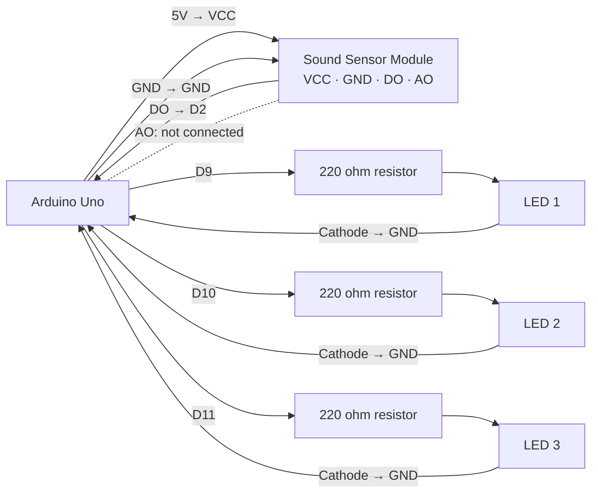
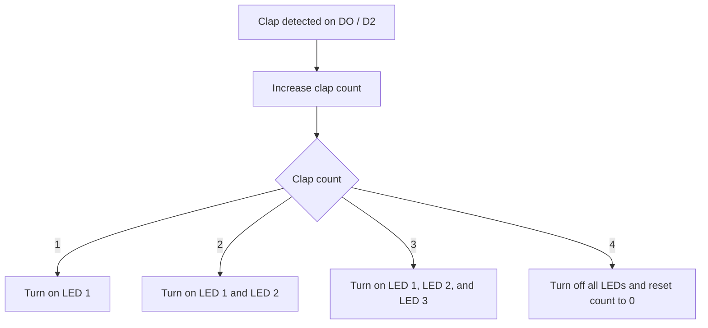

# Electronics Connections

Wiring guide for the Clap-Activated Lamp Shade activity.

## Components

- Arduino Uno
- Sound sensor module with **VCC, GND, DO, and AO** pins
- 3 standard LEDs (LED 1, LED 2, and LED 3)
- 3 × 220 ohm resistors (one per LED)
- Jumper wires

## Connections

| Component | Pin / Terminal | Connected To | Notes |
| --- | --- | --- | --- |
| Sound sensor module | VCC | Arduino 5V | Sensor power |
| Sound sensor module | GND | Arduino GND | Common ground |
| Sound sensor module | DO | Arduino D2 | Digital clap-detection signal |
| Sound sensor module | AO | Not connected | Analog output is not used by this sketch |
| LED 1 | Anode (+) | Arduino D9 through a 220 ohm resistor | Lights after clap 1 |
| LED 1 | Cathode (-) | Arduino GND | Ground return |
| LED 2 | Anode (+) | Arduino D10 through a 220 ohm resistor | Lights after clap 2 |
| LED 2 | Cathode (-) | Arduino GND | Ground return |
| LED 3 | Anode (+) | Arduino D11 through a 220 ohm resistor | Lights after clap 3 |
| LED 3 | Cathode (-) | Arduino GND | Ground return |

## Pin Assignment

| Arduino Pin | Connected Component | Purpose |
| --- | --- | --- |
| D2 | Sound sensor DO | Clap detection input |
| D9 | LED 1 anode (via 220 ohm resistor) | First LED output |
| D10 | LED 2 anode (via 220 ohm resistor) | Second LED output |
| D11 | LED 3 anode (via 220 ohm resistor) | Third LED output |
| 5V | Sound sensor VCC | Power supply |
| GND | Sound sensor GND and all LED cathodes | Common ground |

## Mermaid Wiring Diagram

## Signal Flow

## Notes and Assumptions

- This wiring deliberately shows direct point-to-point connections; no breadboard rails are used in the diagram.
- The four-pin sensor's **AO** pin is present but unused. The program reads only **DO**.
- The sketch assumes the sensor's DO pin goes **LOW** when it detects a clap, which is common for KY-038/KY-037-style modules. If your module reports a clap as HIGH, change `SOUND_ACTIVE_STATE` in the sketch to `HIGH`.
- Adjust the sensor module's sensitivity potentiometer until a clap triggers one count reliably without background noise creating extra counts.
- Use one resistor per LED, and make sure all grounds are connected to Arduino GND.
