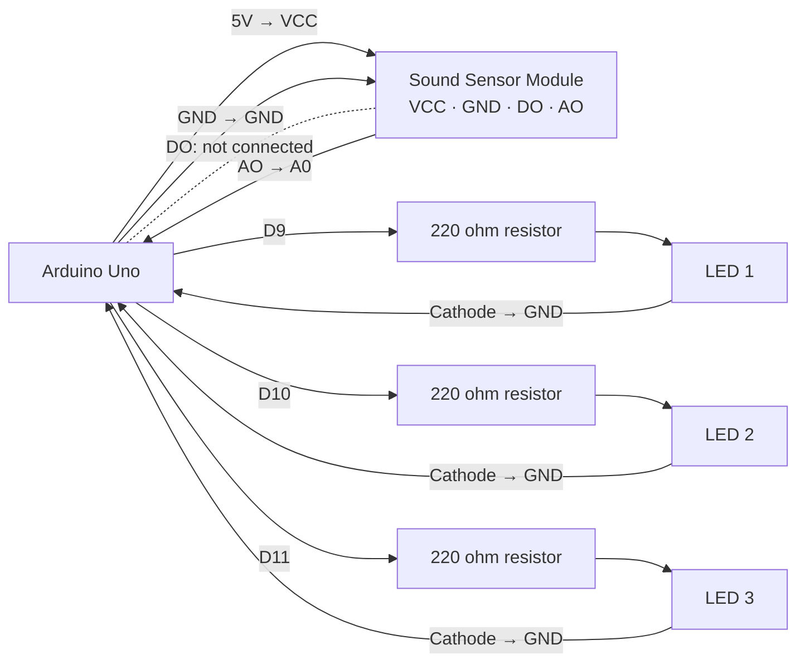
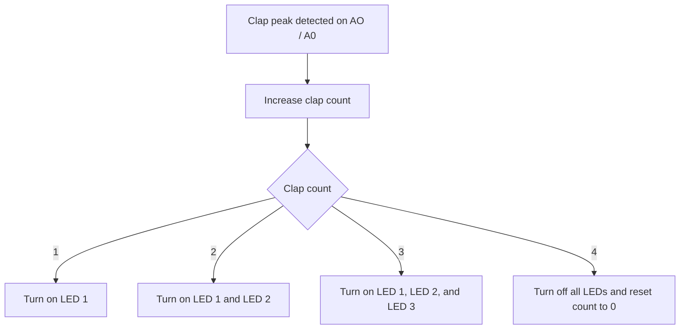

# Electronics Connections

Wiring guide for the Clap-Activated Lamp Shade activity.

## Components

- Arduino Uno
- Sound sensor module with **VCC, GND, DO, and AO** pins
- 3 standard LEDs (LED 1, LED 2, and LED 3)
- 3 × 220 ohm resistors (one per LED)
- Jumper wires

## Connections

| Component | Pin / Terminal | Connected To | Notes |
| --- | --- | --- | --- |
| Sound sensor module | VCC | Arduino 5V | Sensor power |
| Sound sensor module | GND | Arduino GND | Common ground |
| Sound sensor module | DO | Not connected | Digital comparator output is not used |
| Sound sensor module | AO | Arduino A0 | Analog sound signal used for clap detection |
| LED 1 | Anode (+) | Arduino D9 through a 220 ohm resistor | Lights after clap 1 |
| LED 1 | Cathode (-) | Arduino GND | Ground return |
| LED 2 | Anode (+) | Arduino D10 through a 220 ohm resistor | Lights after clap 2 |
| LED 2 | Cathode (-) | Arduino GND | Ground return |
| LED 3 | Anode (+) | Arduino D11 through a 220 ohm resistor | Lights after clap 3 |
| LED 3 | Cathode (-) | Arduino GND | Ground return |

## Pin Assignment

| Arduino Pin | Connected Component | Purpose |
| --- | --- | --- |
| A0 | Sound sensor AO | Analog clap-detection input |
| D9 | LED 1 anode (via 220 ohm resistor) | First LED output (HIGH = on) |
| D10 | LED 2 anode (via 220 ohm resistor) | Second LED output (HIGH = on) |
| D11 | LED 3 anode (via 220 ohm resistor) | Third LED output (HIGH = on) |
| 5V | Sound sensor VCC | Power supply |
| GND | Sound sensor GND and all LED cathodes | Common ground |

## Mermaid Wiring Diagram

## Signal Flow

## Notes and Assumptions

- This wiring deliberately shows direct point-to-point connections; no breadboard rails are used in the diagram.
- Connect the four-pin sensor's **AO** pin to **A0**. Leave **DO** disconnected. The sketch measures short analog sound peaks instead of relying on the module's DO comparator.
- The default `CLAP_THRESHOLD` is 55 to reject ordinary room noise. If normal claps are missed, lower it in steps of 5; if false claps occur, raise it in steps of 10. Use Serial Monitor's `peak` value to choose a threshold above quiet-room peaks but below clap peaks.
- Use one resistor per LED. With this wiring, the sketch sets a pin HIGH to turn its LED on and LOW to turn it off.
- For troubleshooting, open Serial Monitor at **9600 baud**. The sketch prints the analog sound `peak`, active state, readiness, clap count, and commanded LED states every 250 ms.
- The sketch accepts only a short sound burst (at most 180 ms), then waits 600 ms and requires 250 ms of quiet before accepting another one. Sustained blowing is ignored. Clap about once per second for reliable counting.
